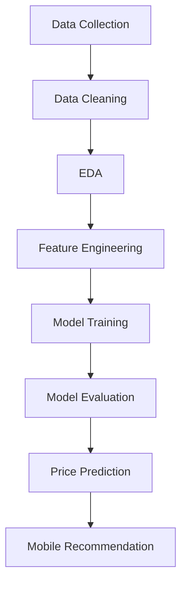

# 📱 Mobile Price Recommendation System

<div align="center">

# 🚀 AI-Powered Mobile Price Recommendation & Price Prediction System

### Predict smartphone price categories using Machine Learning and recommend the best mobile devices based on specifications.


</div>

---

## 📌 Overview

The **Mobile Price Recommendation System** is a Machine Learning project that predicts smartphone price categories based on technical specifications such as RAM, battery power, storage, camera quality, and display features.

The system helps users identify the most suitable smartphones within their budget while demonstrating a complete end-to-end Data Science workflow.

### 🎯 Key Features

- 📊 Data Analysis & Visualization
- 🧹 Data Cleaning & Preprocessing
- 🤖 Machine Learning Classification Models
- 📱 Mobile Price Prediction
- 🎯 Smartphone Recommendation System
- 📈 Performance Evaluation & Insights

---

## 🎯 Problem Statement

With hundreds of smartphone models available in the market, choosing the right mobile device can be difficult.

This project aims to:

✅ Predict smartphone price ranges

✅ Recommend devices based on specifications

✅ Support data-driven purchasing decisions

✅ Analyze factors affecting mobile pricing

---

## 🛠️ Tech Stack

| Category | Tools |
|-----------|---------|
| Programming | Python |
| Data Analysis | Pandas, NumPy |
| Visualization | Matplotlib, Seaborn |
| Machine Learning | Scikit-Learn |
| Development | Jupyter Notebook |
| Version Control | Git & GitHub |

---

## 📂 Project Structure

```bash
Mobile-Price-Recommendation-System/
│
├── dataset/
│   └── mobile_price.csv
│
├── notebooks/
│   └── Mobile_Price_Prediction.ipynb
│
├── models/
│   └── trained_model.pkl
│
├── screenshots/
│   ├── dashboard.png
│   └── prediction.png
│
├── requirements.txt
├── README.md
└── LICENSE
```

---

## 📊 Dataset Features

The dataset contains smartphone specifications such as:

| Feature | Description |
|----------|------------|
| Battery Power | Battery capacity (mAh) |
| RAM | Memory size |
| Internal Memory | Storage size |
| Clock Speed | Processor speed |
| Mobile Weight | Device weight |
| Screen Height | Display size |
| Screen Width | Display width |
| Front Camera | Front camera megapixels |
| Primary Camera | Rear camera megapixels |
| Bluetooth | Bluetooth support |
| WiFi | WiFi support |
| Touch Screen | Touch capability |
| 4G Support | 4G connectivity |

---

## 📈 Exploratory Data Analysis

The project includes:

- Feature Distribution Analysis
- Correlation Heatmap
- RAM vs Price Analysis
- Battery vs Price Analysis
- Camera Impact Analysis
- Feature Importance Visualization
- Price Range Comparisons

### Sample Insights

📌 RAM is one of the strongest predictors of smartphone pricing.

📌 Devices with larger internal memory generally belong to higher price categories.

📌 Processor performance significantly influences market value.

📌 Camera quality contributes to premium pricing.

---

## 🤖 Machine Learning Models

Several classification algorithms were evaluated:

| Model | Purpose |
|---------|----------|
| Logistic Regression | Classification |
| Decision Tree | Classification |
| Random Forest | Classification |
| K-Nearest Neighbors | Classification |
| Support Vector Machine | Classification |

### Evaluation Metrics

- Accuracy Score
- Precision
- Recall
- F1 Score
- Confusion Matrix

---

## 🔄 Project Workflow



---

## 🚀 Installation

### Clone Repository

```bash
git clone https://github.com/Shridharpatil1958/Mobile-Price-Recommendation-System.git
```

### Navigate to Project Folder

```bash
cd Mobile-Price-Recommendation-System
```

### Install Required Libraries

```bash
pip install -r requirements.txt
```

### Launch Jupyter Notebook

```bash
jupyter notebook
```

---

## 📱 Example Prediction

### Input Specifications

```text
RAM: 8 GB
Storage: 128 GB
Battery: 5000 mAh
Rear Camera: 64 MP
Processor Speed: 2.8 GHz
```

### Output

```text
Predicted Price Category:
Premium Smartphone
```

---

## 📊 Business Impact

### 👤 Customers

- Better purchasing decisions
- Personalized recommendations
- Budget optimization

### 🏪 Retailers

- Market segmentation
- Competitive pricing analysis
- Inventory planning

### 🏭 Manufacturers

- Product positioning
- Feature optimization
- Pricing strategy

---

## 📸 Project Screenshots

### Dashboard


### Prediction Result


> Add your project screenshots to the `screenshots/` folder.

---

## 🔮 Future Improvements

- 🌐 Streamlit Web Application
- 📱 Real-Time Mobile Recommendation Engine
- 🤖 Deep Learning Models
- 📈 Mobile Price Forecasting
- 🛒 E-Commerce Integration
- 🎯 Personalized Recommendation System

---

## 📚 Skills Demonstrated

- Data Cleaning
- Feature Engineering
- Exploratory Data Analysis
- Machine Learning
- Classification Modeling
- Model Evaluation
- Recommendation Systems
- GitHub Project Documentation

---

## 👨‍💻 Author

### Shridhar Patil

🎓 Computer Science Engineer

📊 Data Analyst | Data Scientist | Machine Learning Enthusiast

📧 Email: shridharpatil0513@gmail.com

🔗 GitHub: https://github.com/Shridharpatil1958

---

## ⭐ Support

If you found this project helpful:

⭐ Star this repository

🍴 Fork this repository

📢 Share it with others

🤝 Contribute improvements

---

<div align="center">

### 💡 Transforming Mobile Specifications into Smart Recommendations

**Made with ❤️ by Shridhar Patil**

</div>
